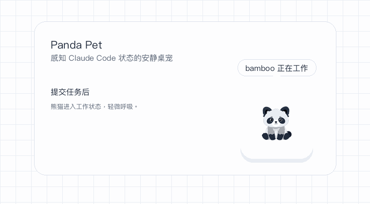

# 🐼 Panda Pet · 熊猫桌宠

> 一只安静陪你写代码的桌宠。

用 Claude Code 时，它感知你的任务状态——你忙它就安静陪着，任务跑完轻轻高兴一下并提醒你，闲下来就打个盹。不催、不评判、不聊天，存在感很低，但需要的那一刻它在。

<p align="center">
  
</p>

## 它怎么工作

两个互相解耦的部分，通过一个本地状态文件通信，任一方崩溃都不影响另一方：

```
Claude Code ──(hooks)──▶ 状态文件 ──(轮询)──▶ 桌宠窗口（熊猫）
   采集层 hooks/                              展示层 app/
```

- **采集层** `hooks/`：Claude Code 触发一个 Python 脚本，把当前状态写进本地文件。
- **展示层** `app/`：一个常驻的 Electron 窗口，轮询状态文件，驱动熊猫的表情与提醒。

## 安装

**先决条件**（两种方式都需要）：已装 [Claude Code](https://claude.com/claude-code)，以及 **Python 3**
（hook 脚本要用，纯标准库免依赖；macOS 一般随 Xcode 命令行工具自带，Windows 到
[python.org](https://www.python.org/) 安装、记得勾选 "Add to PATH"）。

### 方式一：下载安装包（推荐给大多数人）

到 [Releases](../../releases) 下载对应系统的包，装好打开即可：

- **macOS**：下载 `.dmg`，把熊猫拖进"应用程序"。首次打开若提示"来自身份不明的开发者"
  （因为这是未签名的开源应用）——**右键图标 → 打开 → 再点"打开"**即可，只需一次。
- **Windows**：下载 `.exe` 安装包运行。若 SmartScreen 拦截，点**"更多信息" → "仍要运行"**。

打开后，屏幕右下角出现熊猫，菜单栏/托盘也有它的图标。

### 方式二：从源码运行（开发者）

额外需要 [Node.js](https://nodejs.org/) 18+。

```bash
cd app
npm install
npm start
```

### 接入 Claude Code（自动完成）

不用手动改任何配置。桌宠**首次启动时会自动**把采集 hooks 写进你的用户级
`~/.claude/settings.json`——`collector.py` 的绝对路径自动探测，只合并 hooks、
不动你其它设置，改动前会先备份原文件；已装好则跳过。装好后对**所有项目**生效。

<details>
<summary>它写了什么 / 如何关闭或卸载</summary>

- 写入的是 `SessionStart` / `UserPromptSubmit` / `Notification` / `Stop` / `SessionEnd`
  五个事件，各指向本项目的 `hooks/collector.py`（映射见下方「技术细节」）。
- **不想自动写**：在用户配置目录的 `config.json` 里设 `"hooks": { "autoInstall": false }`，
  再手动把那五个事件配到 `collector.py`。
- **卸载**：从 `~/.claude/settings.json` 删掉命令含 `collector.py` 的那几条，
  或用改动前生成的 `~/.claude/settings.json.panda-bak-*` 备份还原。

</details>

### 试一下

开一个 Claude Code 会话发个任务，看右下角的熊猫：

- 提交任务 → **工作中**，安静陪着
- 任务完成 → **高兴一下**，播放一次提示音
- 关闭会话 / 闲置 → 回到**空闲**，静置久了开始**打盹**

**并行多个窗口也只有一只熊猫**：它聚合所有会话，只要有一个在跑就是「工作中」。某个窗口跑完
或需要你输入时，提醒会**点名是哪个项目**（如「bamboo 好了」）；**点一下熊猫**能展开看所有
进行中的会话各自在忙什么。

## 状态一览

| 状态 | 熊猫表现 |
|---|---|
| 工作中 | 安静陪着，轻微「呼吸」动效（和空闲区分） |
| 完成 | 高兴一下 + 一次性提示音，停留片刻回落 |
| 等待输入 | 安静看向你 + 轻提醒 |
| 空闲 | 端坐 → 静置约 30s 发呆 → 约 90s 打盹 |
| 深夜 | 空闲遇上深夜（默认 22:00–07:00）显「深夜」神情 |

多会话聚合规则：**任一在工作中即工作中**，否则 等待 > 完成 > 空闲。提示音需你自备（见下），缺文件则静默。

## 皮肤 / 角色（扩展点）

桌宠的形象**不写死**——熊猫只是默认角色，你完全可以做成猫、狗、水豚，任何你喜欢的。
一套皮肤就是一个「角色包」。它可以放在三处（同名时后者优先）：

| 位置 | 用途 |
|---|---|
| `app/assets/skins/online/<名字>/` | **共享皮肤**，进代码仓库、公开分享 |
| `app/assets/skins/local/<名字>/` | **私有皮肤**，在仓库里但被 gitignore、不提交（比如自家照片） |
| `<用户配置目录>/skins/<名字>/` | 装机版用户自己加的（macOS `~/Library/Application Support/PandaPet/skins`、Windows `%APPDATA%\PandaPet\skins`）|

一个角色包的内容：

```
<名字>/
├── idle.png        # 各状态的图，按约定命名（必需 idle.png）
├── waiting.png
├── done.png
├── sleeping.png
├── daze.png
├── night.png
├── lines.json      # 这个角色的台词（碎碎念，可选）
└── prompt.md       # 生这套图的即梦提示词（开源参考，可选）
```

**加一套 = 新建这个文件夹、按约定名放好图即可**，不用写任何清单文件。托盘「皮肤 ▸」
会自动列出，点选即时切换。内置 `熊猫` 一套（在 `online/`）。

**约定命名** —— 每个状态对应一个固定文件名，放对就能用：

| 状态 | 文件名 |
|---|---|
| 空闲 / 工作中 | `idle.png`（`working` 复用它，靠「呼吸」动效区分） |
| 等待输入 | `waiting.png` |
| 完成 | `done.png` |
| 打盹 | `sleeping.png` |
| 发呆 | `daze.png` |
| 深夜 | `night.png` |

**背景会自动处理，零配置。** 加载时采样图片**上方两个角**（左上、右上——很多角色图下方是
主体或被裁掉，只有上方是背景，所以以上角为准）：

- 两个上角**都透明** → 已经是透明图，直接用；
- 两个上角**是同一种纯色** → 判定为纯色背景，自动把这个颜色**色键抠掉**（绿幕原理，边缘带羽化）；
- 两个上角**不一致**（照片、渐变等） → 判定为非纯色底，原样不动，避免误伤。

所以你只要二选一：**用透明 PNG**，或者**把背景涂成一个「角色里绝不会出现」的纯色**
（比如荧光品红、荧光绿）——不用填任何颜色值，程序自己从四角认出来。

> 用「角色里没有的颜色」是关键：色键是按颜色抠的，如果背景色和主体某处同色（比如白底 + 白衣服），
> 那部分主体也会被一起抠掉。

可选微调（放皮肤目录的 `manifest.json`）：

```json
{ "process": { "keyColor": "#FF00FF", "tolerance": 60, "keyOut": false } }
```

- `keyColor`：手动指定背景色，覆盖自动检测（一般用不上）。
- `tolerance`：色键容差，抠不净调大、边缘吃多了调小（彩色背景按色相、浅色背景按颜色距离，各有默认值）。
- `keyOut: false`：彻底关闭背景抠除（比如白衣白底的照片，不想被动）。

> 彩色纯背景（绿幕/品红幕等）按**色相**抠，能容忍打光造成的明暗不均；主体只要不是这个颜色就不会被误伤。

> 想用别的文件名、或让多个状态复用同一张图？可在皮肤目录放一个可选的 `manifest.json`
> 覆盖这张对照表（`{ "sprites": { "idle": "xxx.png", … } }`）；没有它就走上面的约定命名。

**`lines.json`** —— 台词跟着角色走（猫不会说"……竹子……"），所以每个角色一套：

```json
{ "daily": ["……", "唔。", "（打了个哈欠）"] }
```

`daily` 会低频、随机地冒出来。没有 `lines.json` 的皮肤就安静不碎念。

**`prompt.md`** —— 放上你生这套图用的即梦提示词。别人就能照着**保持同一风格**补图，或改成
自己的角色。这是开源共创的关键，模板见 [`skins/online/熊猫/prompt.md`](app/assets/skins/online/熊猫/prompt.md)。

## 配置

改行为不用动代码。`config.json` 管**应用行为**（与角色无关），默认值在
`app/config/config.default.json`；你的个人覆盖放用户配置目录（托盘「打开配置文件夹」直达）的
`config.json`，**只写想改的字段**：

> 皮肤（`skin`）、自动装 hooks 开关（`hooks.autoInstall`）、Claude Code settings 路径（`hooks.settingsPath`）、轮询频率、过期清理时长、
> 提示音开关与文件、窗口尺寸/置顶/渲染模式（`card`/`transparent`）、完成停留时长、
> 发呆与打盹等待时长（`idleDazeMs`/`idleSleepMs`）、深夜起止（`night`）、
> 逐会话点名提醒开关（`notifyPerSession`）、碎碎念频率。

| 平台 | 用户配置目录 |
|---|---|
| macOS | `~/Library/Application Support/PandaPet` |
| Windows | `%APPDATA%\PandaPet` |
| Linux | `~/.local/share/PandaPet` |

- **台词**不在这里——它属于角色，放在各皮肤的 `lines.json`（见上）。
- **提示音**放 `app/assets/sounds/`（`done.wav` / `waiting.wav`），缺文件静默跳过。
- 如果启动时提示找不到默认 Claude Code 配置，请在 `config.json` 里指定真实的 settings 文件：

```json
{
  "hooks": {
    "settingsPath": "~/Library/Application Support/Claude/settings.json"
  }
}
```

## 目录结构

```
.
├── hooks/                    # 采集层：Claude Code hook 脚本（Python）
├── app/                      # 展示层：Electron 桌宠
│   ├── assets/
│   │   ├── skins/
│   │   │   ├── online/      # 共享角色包（进仓库，如 熊猫）
│   │   │   └── local/       # 私有角色包（gitignore，不提交）
│   │   └── sounds/           # 提示音
│   ├── config/               # 应用配置（轮询/音效/窗口/行为）
│   └── ...
├── DESIGN.md                 # 设计理念（为什么这么设计）
└── README.md
```

## 技术细节

<details>
<summary>hook 事件 → 状态、状态文件格式、脱离 Claude Code 联调</summary>

`hooks/collector.py` 由 hooks 触发，把每个会话的状态写成一个文件供桌宠轮询。纯 Python 标准库、
无依赖；原子写（临时文件 + rename，读方不会读到半个文件）；任何异常都吞掉并 `exit 0`，绝不阻塞
Claude Code；只忠实记录「最近事件 + 状态 + 时间戳」，不做任何判断。

**事件 → 状态**（事件名在 Claude Code 2.1.198 / macOS 真机验证过；换大版本建议重新核对）：

| Hook 事件 | 触发时机 | 写入状态 |
|---|---|---|
| `SessionStart` | 会话开启 / 恢复 | `idle` |
| `UserPromptSubmit` | 提交任务 | `working` |
| `Notification` | 等待输入 / 请求权限 | `waiting` |
| `Stop` | 回复完成 | `done` |
| `SessionEnd` | 会话结束 | 删除该会话的状态文件 |

**状态文件**：每个会话一个，位于 `<用户数据目录>/PandaPet/sessions/<会话id>.json`：

```json
{
  "state": "idle | working | waiting | done",
  "active_agents": 0,
  "last_event": "Stop",
  "updated_at": "2026-07-02T08:27:59Z",
  "session_id": "9a2f1087-...",
  "cwd": "/Users/me/proj/bamboo",
  "message": "可选：提交任务时带一句截断的 prompt"
}
```

`cwd` 用于在提醒里点名「哪个项目」并聚合多会话。

**脱离 Claude Code 联调**：给桌宠和 `collector.py` 设同一个环境变量 `PANDAPET_STATE_DIR`
指向一个临时目录，手动往里写/删 `<会话id>.json` 即可驱动熊猫。

</details>

<details>
<summary>发布新版本（维护者）</summary>

安装包由 GitHub Actions 自动构建（`.github/workflows/release.yml`）：**推一个版本 tag 即可**，
CI 会在 macOS（通用包，Intel + Apple 芯片都能跑）和 Windows 上打包，挂到对应的 GitHub
Release（默认草稿，检查无误后手动点发布）：

```bash
# 改好 app/package.json 里的 version 后
git tag v0.1.0 && git push origin v0.1.0
```

也可以本地出包：`cd app && npm run dist:mac`（或 `dist:win`），产物在 `app/dist/`。

实现要点：`hooks/` 作为 `extraResources` 随包携带（在 asar 外，`collector.py` 才能被 Python
执行），应用按打包后的路径自动找它；未签名（没买证书），用户首次打开按上面「安装」放行；
图标在 `app/build/`。

</details>

## 设计取向

小而克制，是它和其它桌宠最大的不同。它**不做**这些：

- ❌ 聊天机器人 / AI 助手——它不与你对话
- ❌ 进程管理 / 自动启动 Claude Code——它只是感知者
- ❌ token / 花费 / git 数据仪表盘——走极简、重陪伴的路线

改代码前建议读一读 [DESIGN.md](DESIGN.md)——它讲清了这只熊猫为什么这样设计，别把它改成又一个话痨工具。

## 路线图

- **现在**：状态感知（工作中 / 完成 / 空闲 / 发呆 / 深夜）、完成提醒、多会话聚合与点名提醒、点击看会话列表、日常碎碎念、疲惫 / 深夜的稀有彩蛋、皮肤切换、配置外置、双平台
- **接下来**：序列帧动画
- **以后**：社区共创皮肤、更丰富的动画、自动打包

## License

MIT
